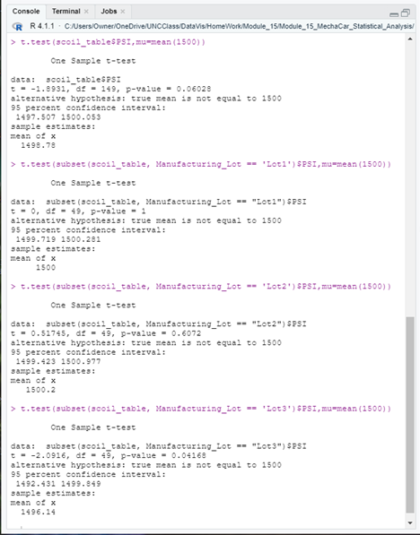

# Module_15_MechaCar_Statistical_Analysis
UNC Bootcamp - Module 15 Challenge

## Project Overview 
This analysis was done to provide insights on the production of the MechaCar, the latest prototype vehicle from AutosRUs. Summary data was produced and reviewed for any impact to the manufacture of the MechaCar.  A proposed additional statistical study was also provided.  

## Linear Regression to Predict MPG

•	Which variables/coefficients provided a non-random amount of variance to the mpg values in the dataset? 

    o	A linear regression was done to evaluate each factor for their affect on mpg.  The regression shows that the vehicle_length and ground_clearance produce non-random values and can be considered significant to the evaluation.

•	Is the slope of the linear model considered to be zero? Why or why not?

    o	The p-value was 5.35e-11, which is very small and would indicate the slope is not zero.

•	Does this linear model predict mpg of MechaCar prototypes effectively? Why or why not?

    o	The r-squared value of 71% shows that the model is effective at predicting the mpg of the prototypes.

&nbsp;&nbsp;&nbsp;&nbsp;&nbsp;    
 
&nbsp;&nbsp;&nbsp;&nbsp;&nbsp;    

## Summary Statistics on Suspension Coils

•	The design specifications for the MechaCar suspension coils dictate that the variance of the suspension coils must not exceed 100 pounds per square inch. Does the current manufacturing data meet this design specification for all manufacturing lots in total and each lot individually? Why or why not?

    o	Summary statistics were produced for the suspension coils data by Manufacturing Lot and for all lots combined.  The combined value did meet the specification with a variance value of 62.29.  Querying the data for each lot showed that not all lots were within the specified range.  Manufacturing Lot 3 had a variance of 170.29, well outside the 100psi required.

 
&nbsp;&nbsp;&nbsp;&nbsp;&nbsp;    
 
 
&nbsp;&nbsp;&nbsp;&nbsp;&nbsp;    
 

## T-Tests on Suspension Coils

•	Perform t-tests to determine if all manufacturing lots and each lot individually are statistically different from the population mean of 1,500 pounds per square inch.

    o	A t-test was  performed to look at PSI for all manufacturing lots to see how they compared to the population mean of 1,500 pounds.  The test showed they were comparable, with a mean value of 1,498.78 and a median value of 1,500

    o	T-tests were then done on each of the three lots to see if they were all within range of the 1,500 pounds.  Lots 1  and 2  were good, with both showing mean value of 1,500, but Lot 3 under the acceptable value, showing a mean value of 1,496.14 and a median value of 1,498.5.   Additional analysis is needed to determine the reason Lot 3 was outside the population value. 

&nbsp;&nbsp;&nbsp;&nbsp;&nbsp;    
 

## Study Design: MechaCar vs Competition

•   Write a short description of a statistical study that can quantify how the MechaCar performs against the competition

•	What metric or metrics are you going to test?

    o	There are several metrics that could be tested to give a clearer analysis of the MechaCar versus the competition, but not all metrics are important to all customers.  The demographic group the MechaCar is designed for may have different priorities than other groups.  Is cost and maintenance cost the main considerations for an urban couple with children?  Does a young person living in the city want the best fuel efficiency for the most horse power? One area that is probably important to everyone is safety.  Whether in the city, suburbs, or urban, everyone want to feel safe when they are driving.

•	What is the null hypothesis or alternative hypothesis?

    o	The null hypothesis would be that there is no difference in the safety ratings of MechCars and the competitors.  The alternative hypothesis is there is a difference in the safety ratings.

•	What statistical test would you use to test the hypothesis? And why?

    o	With the assumption that multiple competitor ratings would be included, a one-way ANOVA test could be used to compare the data.  This would allow multiple groups to be included for a clearer picture of the MechaCar standings among other similar vehicles.

•	What data is needed to run the statistical test?

    o	Safety rating data from an independent source would be needed.  Including only similar vehicles would limit the data available but may provide more depth to the analysis of the MechaCar production.  

